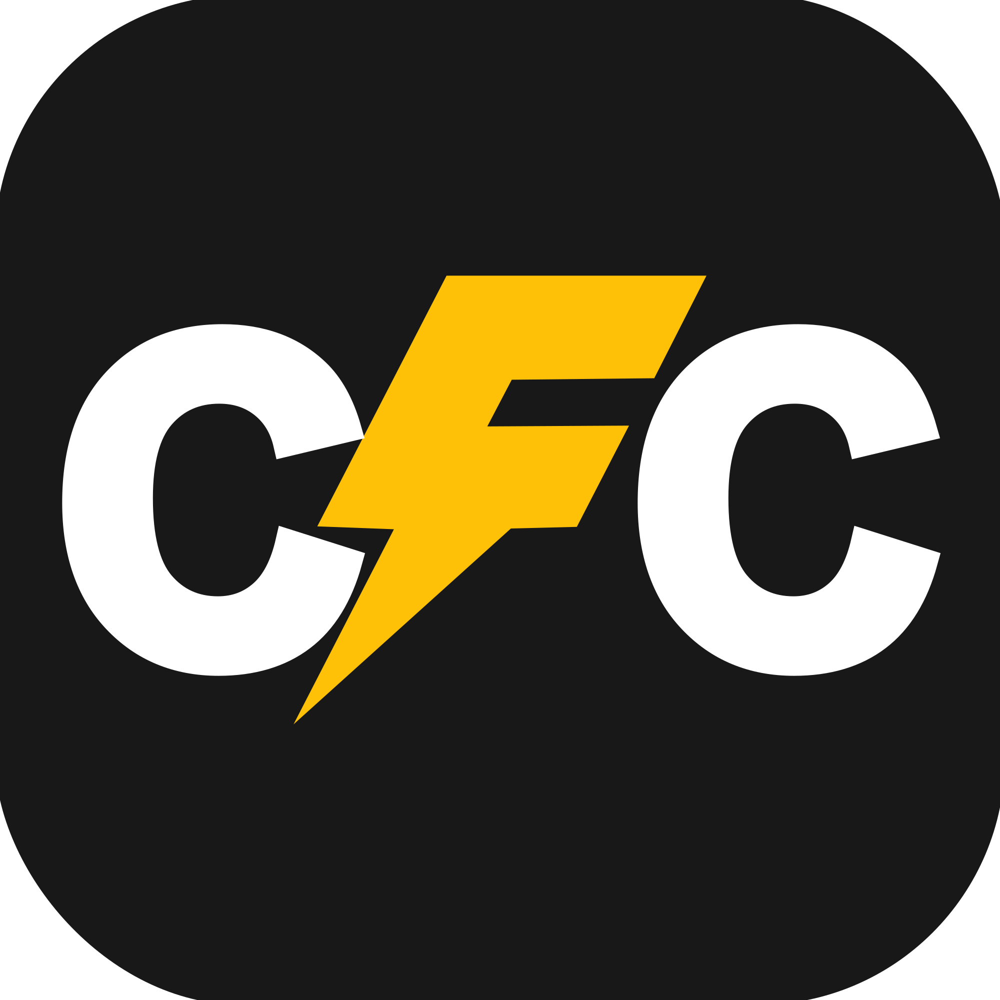

<div align="center">
  
</div>

# Context File Concatenator (CFC)

CFC (Context File Concatenator) is a desktop application designed to intelligently select, filter, and combine project files into a single text file. This output is optimized for use with Large Language Models (LLMs), providing them with the necessary context to understand and analyze a codebase.

## Key Features

- **High-Performance Scanning**: Engineered for speed, CFC handles large repositories with ease.
  - **Proactive Scanning**: An initial, shallow scan provides immediate UI feedback, while a full scan continues indexing in the background.
  - **Lazy Loading**: Directory contents are loaded on-demand as you expand them, eliminating long initial wait times.
  - **UI Virtualization**: The file tree uses virtual scrolling to ensure the UI remains smooth and responsive, even with tens of thousands of files.
- **Directory Selection**: Easily select a project directory using a native file dialog or by dragging and dropping it into the application.
- **Interactive File Tree**: View your project structure in a familiar tree view. Select or deselect individual files or entire directories.
- **Flexible Filtering**:
  - Filter files by name (case-sensitive or insensitive).
  - Filter by file extension (e.g., show only `.rs` or `.py` files).
  - Search for text content within files.
- **Powerful Ignore System**:
  - Powered by the `ignore` crate, it automatically respects rules from `.gitignore`, `.git/info/exclude`, and global git config files.
  - Add and remove custom patterns dynamically.
  - Click the ignore button next to any file or folder in the tree to ignore it instantly.
- **Syntax Highlighting**: Preview individual files or the final concatenated output with syntax highlighting in a built-in Monaco editor.
- **Configuration Management**:
  - Import and export your settings (including ignore patterns) as a JSON file to share configurations across projects or teams.
  - Window size, position, and other settings are automatically saved between sessions.
- **Customizable Output**:
  - Choose to include an ASCII directory tree at the start of the output file.
  - Use relative or absolute file paths in the output headers.

---

## Installation

### Download

Download the latest version for your platform from the [**GitHub Releases page**](https://github.com/src-dbgr/context-file-concat/releases/latest).

- **macOS**: Choose the appropriate DMG file for your Mac:
  - `context-file-concat-x.x.x-macos-aarch64.dmg` for Apple Silicon Macs (M1/M2/M3/M4)
  - `context-file-concat-x.x.x-macos-x86_64.dmg` for Intel-based Macs
- **Windows**: Download `context-file-concat-x.x.x-windows-x86_64.zip`
- **Linux**: Download `context-file-concat-x.x.x-linux-x86_64.tar.gz`

> **Note**: Not sure which Mac version you have? Open Terminal and run `uname -m`. If it shows `arm64`, use the `aarch64` version. If it shows `x86_64`, use the `x86_64` version.

### macOS Installation

1. **Download and open the DMG file** from the releases page
2. **Drag the app** to your `Applications` folder (or any location you prefer)
3. **Eject the DMG** by clicking the eject button or pressing `Cmd+E`
4. **Bypass Gatekeeper** (required for unsigned apps):
   ```bash
   sudo xattr -rd com.apple.quarantine /Applications/Context\ File\ Concatenator.app
   ```
   Enter your admin password when prompted.
5. **Launch the app** from Applications or Spotlight

> **Why the terminal command?** macOS Gatekeeper blocks unsigned applications for security. This one-time command tells macOS that you trust this app.

**Alternative method**: Right-click the app and select "Open", then click "Open" in the security dialog.

### Windows Installation

1. **Download the ZIP file** from the releases page
2. **Extract the contents** to a folder of your choice (e.g., `C:\Program Files\Context File Concatenator\`)
3. **Run** `context-file-concat.exe` from the extracted folder
4. **Optional**: Create a desktop shortcut or pin to Start Menu for easier access

> **Security warning?** Windows Defender SmartScreen might warn about the unsigned executable. Click "More info" and then "Run anyway" to proceed.

### Linux Installation

1. **Download the tar.gz file** from the releases page
2. **Extract to your preferred location**:
   ```bash
   tar -xzf context-file-concat-x.x.x-linux-x86_64.tar.gz -C ~/.local/bin/
   # Or to /usr/local/bin/ for system-wide installation:
   sudo tar -xzf context-file-concat-x.x.x-linux-x86_64.tar.gz -C /usr/local/bin/
   ```
3. **Make executable** (if needed):
   ```bash
   chmod +x ~/.local/bin/context-file-concat
   ```
4. **Run the application**:
   ```bash
   context-file-concat
   # Or launch from your applications menu if using desktop environment
   ```

**System Requirements**: Most modern Linux distributions with GTK3 and WebKit2GTK. Install dependencies if needed:

```bash
# Ubuntu/Debian:
sudo apt-get install libwebkit2gtk-4.1-0 libgtk-3-0

# Fedora:
sudo dnf install webkit2gtk4.1 gtk3

# Arch Linux:
sudo pacman -S webkit2gtk-4.1 gtk3
```

### Troubleshooting

**macOS**: If you get "damaged and can't be opened" errors, ensure you've run the `xattr` command after copying the app to Applications.

**Windows**: If the app doesn't start, ensure you have the [Microsoft Visual C++ Redistributable](https://learn.microsoft.com/en-us/cpp/windows/latest-supported-vc-redist) installed.

**Linux**: If you encounter missing library errors, install the system dependencies listed above for your distribution.

---

## Architecture & Design

CFC is built on a modern hybrid architecture, combining a high-performance **Rust** backend with a reactive **Svelte** and **TypeScript** frontend running in a WebView. This approach delivers a native feel with the flexibility of web technologies.

The design emphasizes key principles like **Separation of Concerns**, **Unidirectional Data Flow**, and **Performance by Design**. Heavy I/O operations are handled asynchronously in Rust to ensure a non-blocking UI, while the frontend uses virtualization to render tens of thousands of files with ease.

For a deep dive into the system's structure, data flows, IPC contracts, and development patterns, please see our comprehensive **[Developer Documentation](./docs/README.md)**.

---

## Quality Assurance & Testing

- **Unit Tests**: The `core` logic is tested with unit tests to ensure the correctness of individual components.
- **Integration Tests**: Key application workflows are covered by integration tests that validate the interaction between the `app` and `core` layers without requiring a live UI.
- **Continuous Integration (CI)**: A GitHub Actions workflow automatically runs `cargo fmt` (formatter), `cargo clippy` (linter), and `cargo test` on every push and pull request to maintain code quality and prevent regressions.

---

## Building from Source

To build and run the application locally, you need [Node.js/npm](https://nodejs.org/) and the [Rust toolchain](https://www.rust-lang.org/tools/install).

1.  **Prepare the Frontend Dependencies:**
    Navigate to the `src/ui` directory and install the necessary JavaScript packages.

    ```bash
    cd src/ui
    npm install
    ```

2.  **Build the Frontend Bundle:**
    This command uses `esbuild` to bundle all JavaScript modules into a single file.

    ```bash
    npm run build
    ```

    For development, `npm run watch` will automatically rebuild on file changes.

3.  **Run the Rust Application:**
    Navigate back to the project root and use Cargo to build and run the app.

    ```bash
    cd ../..
    cargo run
    ```

4.  **Run Tests:** To run the full suite of unit and integration tests, use:

    ```bash
    cargo test
    ```
