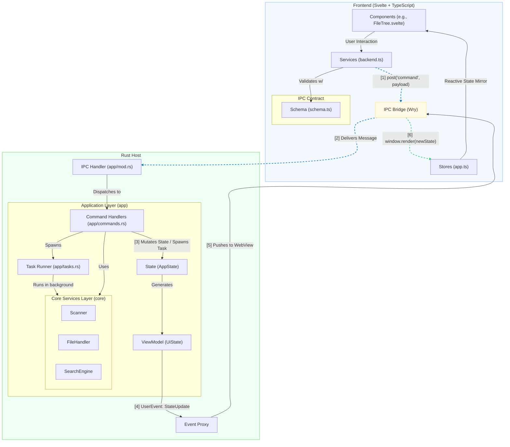

# Architecture

> **TL;DR:** This is a hybrid desktop application using a Rust host to power a web-based UI built with Svelte and TypeScript. The system is layered, featuring a decoupled core logic layer and a dedicated application layer in Rust. Communication between the host and the UI is managed through a strictly-typed, asynchronous IPC bridge. The architecture prioritizes performance, testability, and clear separation of concerns.

## Architectural Principles

This system is designed around several key principles:

- **Separation of Concerns:** The Rust backend is split into two distinct layers:
  1.  **Core Services (`src/core`):** A stateless, pure logic layer responsible for computations like filesystem scanning, search, and content generation. It has no knowledge of the application's state or the UI.
  2.  **Application Layer (`src/app`):** Orchestrates core services, manages the central `AppState`, handles asynchronous tasks, and communicates with the UI.
- **Unidirectional Data Flow:** User interactions in the UI trigger commands to the Rust host. The host mutates its state and then pushes a new, complete `UiState` view model back to the UI. The UI is a reactive reflection of the backend state, preventing inconsistencies.
- **Performance by Design:** Heavy lifting (I/O, search) is offloaded to background threads in Rust to keep the UI responsive. The frontend employs virtualization to efficiently render large file trees, with performance budgets enforced by CI.
- **Type Safety Across Boundaries:** The IPC bridge is defined by a strict contract using Rust structs (Serde) on the backend and Zod schemas on the frontend, eliminating an entire class of runtime errors.

## System Overview

The diagram below illustrates the main components and the two primary data flow paths: the **Command Flow** (from UI to Host) and the **State Update Flow** (from Host to UI).

---

## Architectural Layers

### Host (Rust Backend)

The backend is written in Rust and is responsible for all business logic and system interactions.

- **`src/core/*` (Core Services Layer)**

  - **Responsibilities:** Provides pure, stateless functions for core operations.
  - **Key Modules:**
    - `scanner.rs`: High-performance, cancellable directory traversal using the `ignore` crate.
    - `file_handler.rs`: File I/O, content reading, and final output concatenation.
    - `search.rs`: In-memory filtering of file lists.
    - `tree_generator.rs`: Generation of ASCII directory trees.
  - **Characteristics:** Fully decoupled from the application. It receives data, processes it, and returns a result or an error (`CoreError`). It has no concept of application state.

- **`src/app/*` (Application Layer)**

  - **Responsibilities:** Acts as the central nervous system. It orchestrates Core services, manages state, and serves as the bridge to the UI.
  - **Key Modules:**
    - `state.rs`: Defines the single source of truth, `AppState`, managed within an `Arc<Mutex<...>>` for safe concurrent access.
    - `commands.rs`: Contains all functions callable by the UI via IPC. These functions are the only ones permitted to mutate `AppState`.
    - `tasks.rs`: Encapsulates long-running, asynchronous operations (like scanning or file search) that are spawned into background threads to avoid blocking. It uses traits for dependency injection, making it highly testable.
    - `view_model.rs`: Transforms the internal `AppState` into the serializable `UiState` that is sent to the frontend. This ensures the UI only receives the data it needs in the correct shape.
    - `events.rs`: Defines the `UserEvent` enum (Host → UI) and `IpcMessage` struct (UI → Host), which form the IPC contract.

---

### Frontend (Svelte + TypeScript)

The frontend is a Single Page Application (SPA) responsible for all rendering and user interaction.

- **`src/ui/src/lib/ipc` & `src/ui/src/lib/services` (IPC & Services Layer)**

  - **Responsibilities:** Manages all communication with the Rust host.
  - `schema.ts`: Uses **Zod** to define runtime-validated schemas for all incoming and outgoing IPC messages. This creates a robust, self-documenting contract that prevents malformed data from crossing the boundary.
  - `handlers.ts`: Defines global `window.*` functions that are called by the Rust host to deliver events (e.g., `window.render(newState)`). These handlers validate incoming data against the Zod schemas before processing.
  - `backend.ts`: Provides a strongly-typed `post(command, payload)` function for sending commands to the host. In development mode, it validates outgoing payloads against the Zod schemas.

- **`src/ui/src/lib/stores` (State Management Layer)**

  - **Responsibilities:** Holds the client-side state.
  - `app.ts`: Contains the main `appState` Svelte store, which acts as a reactive mirror of the `UiState` from the backend.
  - `uiStores.ts`: Contains derived stores that compute UI-specific flags (e.g., `canGenerate`, `isBusy`) from the base `appState`. This simplifies component logic.

- **`src/ui/src/lib/components` (Presentation Layer)**

  - **Responsibilities:** A collection of reusable Svelte components that render the application state.
  - `FileTree.svelte`: A key component that uses a **virtualization** strategy to efficiently render potentially thousands of file entries without overwhelming the DOM, ensuring a smooth user experience.

---

## Key Architectural Patterns

- **State Management:** The application employs a robust, centralized state management pattern.

  1.  The Rust host owns the canonical `AppState`.
  2.  UI actions dispatch commands that mutate this `AppState`.
  3.  After mutation, a new `UiState` view model is generated and pushed to the UI.
  4.  The UI's Svelte store is updated, causing the Svelte components to reactively re-render.
      This unidirectional flow makes the system predictable and easier to debug.

- **Asynchronous Task Handling:** Long-running operations are defined in `app/tasks.rs` and executed via `tokio::spawn`. This prevents the main thread from blocking. Tasks are made cancellable using an `Arc<AtomicBool>`, allowing the user to interrupt operations like a directory scan.

- **Testing and Quality Gates:**

  - **Unit Tests:** Vitest is used for both Rust (`#[cfg(test)]`) and TypeScript (`*.test.ts`) unit tests. The backend's use of traits (`Scanner`, `FileSearcher`, etc.) allows for mocking dependencies and deterministic testing of task logic.
  - **Contract Tests (`src/ui/src/tests/contracts`):** These tests specifically validate the Zod schemas against expected valid and invalid payloads, ensuring the IPC contract remains stable.
  - **E2E Tests (`src/ui/e2e`):** Playwright tests cover critical user flows, accessibility (`a11y`), and performance.
  - **Performance Budgets:** The project enforces strict budgets for both bundle size (Brotli-compressed assets) and interaction performance (e.g., rendering a 25k-node tree), which are checked in CI.

## Extending the System

Adding a new feature typically follows this sequence:

1.  **Core Logic:** Add or extend a function in a `src/core` module if new, pure business logic is required.
2.  **Host Command:** Expose a new command in `src/app/commands.rs` that calls the core logic and mutates the `AppState`.
3.  **IPC Contract:** Describe the command's name and payload shape in `$lib/ipc/schema.ts`.
4.  **UI Action:** Call the new command from the UI using the `post()` service in `$lib/services/backend.ts`.
5.  **State & UI:** Update Svelte stores and components to handle any new state information pushed from the backend.
6.  **Testing:** Cover the new logic with Rust unit tests, TypeScript unit tests, and potentially a Playwright E2E test.
