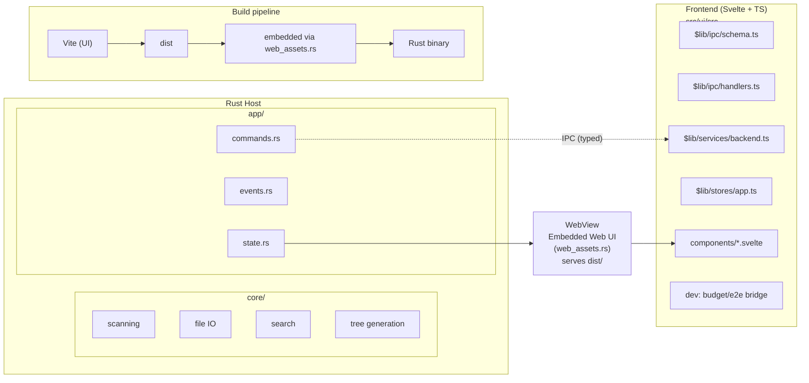

# Architecture

> TL;DR: A Rust host (core + app) drives a WebView UI (Svelte + TS). We talk via a typed IPC layer (request/response + events). The UI renders large trees efficiently with virtualization and ships with measurable budgets and benches.

## System Overview

## Source Layout (selected)

- **`src/core/*`**  
  Low-level logic: filesystem scanning (`scanner.rs`), search (`search.rs`), file concatenation (`file_handler.rs`), tree construction (`tree_generator.rs`). Errors live in `error.rs` for cross-layer mapping.

- **`src/app/*`**  
  Application wiring for the host process: IPC commands (`commands.rs`), event emission (`events.rs`), shared app state (`state.rs`), task orchestration (`tasks.rs`), UI-facing helpers.

- **`src/ui/src/*` (Svelte + TS)**  
  Presentation + interaction. Notable modules:

  - `$lib/ipc/schema.ts` — typed command & event contracts.
  - `$lib/ipc/handlers.ts` — runtime input validation + dispatch to stores.
  - `$lib/services/backend.ts` — thin `post(cmd, ...args)` transport.
  - `$lib/stores/app.ts` — single source of truth for UI state.
  - `$lib/components/*` — e.g. `FileTree.svelte` with virtualization.
  - `lib/dev/*` — benchmarking hooks, e2e bridge, idle helpers.

- **`src/ui/e2e/*`**  
  Playwright tests: a11y, budgets, flows, **benchmarks up to ~25k nodes**.

## Build & Test

- **UI**  
  Vite builds to `src/ui/dist`. Our bundle budgets are enforced by `src/ui/scripts/check-budgets.mjs` (Brotli). See `docs/ci-budgets.md`.

- **Embedding**  
  `web_assets.rs` bundles the built artifacts into the Rust binary.

- **Tests**
  - Unit (UI) with Vitest (`src/ui/src/tests/*`).
  - E2E + benches with Playwright (`src/ui/e2e/*`). Deterministic via a dedicated E2E bridge (`$lib/dev/e2eBridge.ts`, `$lib/dev/e2eShim.ts`) and performance marks (`$lib/dev/budget.ts`).

## Performance Posture

- **Virtualized tree** targets **25k files** comfortably. Tests assert render smoothness and bounded DOM nodes.
- **No “idle prewarm”**: we avoided speculative work. Idle is used only for low-priority chores (`$lib/dev/idle.ts`).
- **Strict budgets**: CI fails if bundles exceed Brotli thresholds; benches gate critical interactions under env-driven thresholds.

## Extending the System

1. Add/extend core logic under `src/core/…`.
2. Expose a command in `src/app/commands.rs`.
3. Describe its payload/shape in `$lib/ipc/schema.ts`; wire handler in `$lib/ipc/handlers.ts`.
4. Update stores/components.
5. Cover with Vitest and, if performance-sensitive, with a bench in Playwright.
