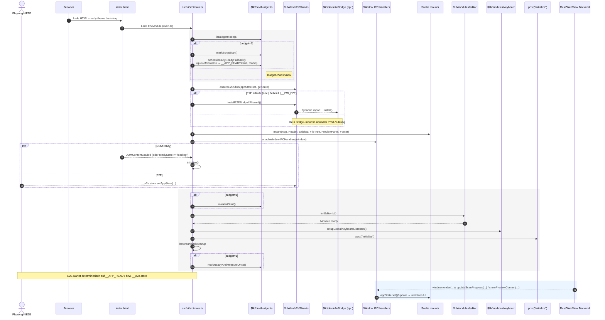

# CI Budgets (Step 4.5)

This project enforces **bundle** and **runtime** budgets in CI.

## Bundle budgets

We split built assets into:

- **ENTRY** – `index.js` (main entry).
- **APP** – all non-worker JS/CSS (application code).
- **WORKERS** – `*.worker-*.js` (Monaco workers: ts/css/html/json/editor).

**Defaults (Brotli):**

- ENTRY ≤ **0.8 MB**
- APP total ≤ **1.0 MB**
- WORKERS total ≤ **1.5 MB**

Configure via environment variables (bytes):

````bash
ENTRY_BROTLI=800000
APP_TOTAL_BROTLI=1000000
WORKER_TOTAL_BROTLI=1500000
# Optional legacy grand total cap:
# BUDGET_TOTAL_BROTLI=2000000

## Runtime budgets (E2E)

E2E tests under `src/ui/e2e/budgets.spec.ts` verify:

1. **First mount time** – measured by `performance.measure('app-init')` in `main.ts` when `?budget=1` is present.
2. **Virtualization smoothness** – with a 25k item file tree, we assert the virtualized DOM rows are ≤ 600 (structural proxy for smoothness).

Env overrides:

- `BUDGET_INIT_MS` (default **1500** ms)
- `BUDGET_VTREE_MS` (default **3000** ms)

> Local runs on Apple Silicon can use stricter values, e.g.
> `BUDGET_INIT_MS=200 npm run test:e2e:budgets`

## How to run locally

```bash
cd src/ui
npm ci
npm run build
npm run budget:bundle

# E2E budget tests (use the same Playwright setup)
npx playwright install --with-deps chromium
npm run test:e2e:budgets
````

## Boot-Sequenz (Mermaid)


